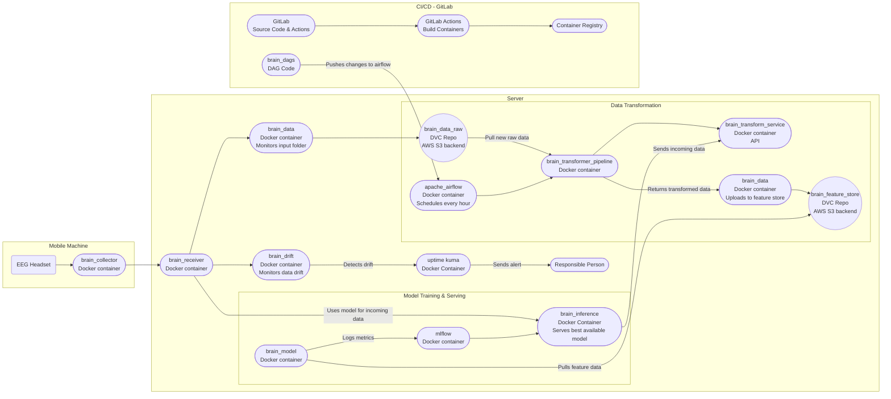

# MLOPS-BRAIN

Welcome to Birthdate Retrieval from Analysis of Inferred Neurodata (BRAIN) - A MLOps System for the prediction of Birthdates based on measured neuro data comming from the [Neurosity Crown](https://neurosity.co/).

# Overview


## User Guide
To use BRAIN you can use the services hosted on openstack under the domain *mlopsbrain.world*.
To run an experiment, the brain_collector repository must be cloned to a local machine and run as described in its repository.
Additionally a `.env` file must be created containing the following content:
<details>
<summary>Click to show the .env contents</summary>

```
API_URL=https://brnrcvr.mlopsbrain.world/upload/
API_USERNAME="brain_collector"
API_PASSWORD="Bruchteil5-Baumholder"
TIME_INTERVAL=0.5
START_YEAR=1990
END_YEAR=2007
```
</details>
While `START_YEAR` and `END_YEAR` can be adapted as needed, `TIME_INTERVAL` should stay at `0.5` as the experiment does not handle different values correctly and a new s3 bucket would need to be created so the different data would not get mixed up. TIME_INTERVAL is the time, each state (day, month or year) is shown to the subject. 
The next step is to create a new conda environment based on the provided ènvironment.yml` running the following commands inside the repo root directory:
```bash
conda env create -f environment.yml
conda activate brain
``` 

Before actually starting the experiment the Neurosity Crown must be on the same wireless network as the machine running brain_collector. Also, the WLAN must actually be connected to the internet, as the headset will only send data when it is connected to the Neurosity server (which is technically not necessary...).

Once the brain_collector has been started with `streamlit run app.py`, you can start the web application at [localhost:8501](http://localhost:8501/).

Before the experiments starts, make sure you are in an quiet environment and are actually thinking about your date of birth. (*At this time, as most effort went into the infrastructure around this model, the model is not very accurate, due to too few samples and low quality of the samples*.)

After clicking on **Start Animation and Data Capture** the days, then months and finally years will be displayed. 
Don't worry, after the animation for days, months or year is finished the processing in the background takes 30ish to 60ish seconds to complete and the app my seem unresponsive. This is normal, so please be patient.
You can also see the predicted values and the distribution, how much each state (displayed day, month or year) seems to be an "outlier".
Since little effort has been put into the model and the acquisition of qualitative data (quiet environment, concentrated subjects, etc.), the validity of the data is rather low.

In Order to train a new model a new, complete datasample must be recorded and stored to the data_raw dvc bucket. This can be achieved by completing one experiment using the brain_collector webApp and providing your real date of birth at the end. 
If the last step was not completed, no new model can be trained, as the lables for the data are missing.
If a new experiment was recorded, at every full hour airflow schedules our etl pipeline, which, if new data is available, transforms the new data and then, starts the model training DAG, which again trains a new model. Currently, to save time, only 2 trials are done for hyperparameter tuning, so the serverload is low and the it is easier to test the whole MLOps cycle.

For local deployment of the infrastructure with Docker, the brain_infrastructure repository can be consulted, or the repositories of the respective containers can be searched. 
