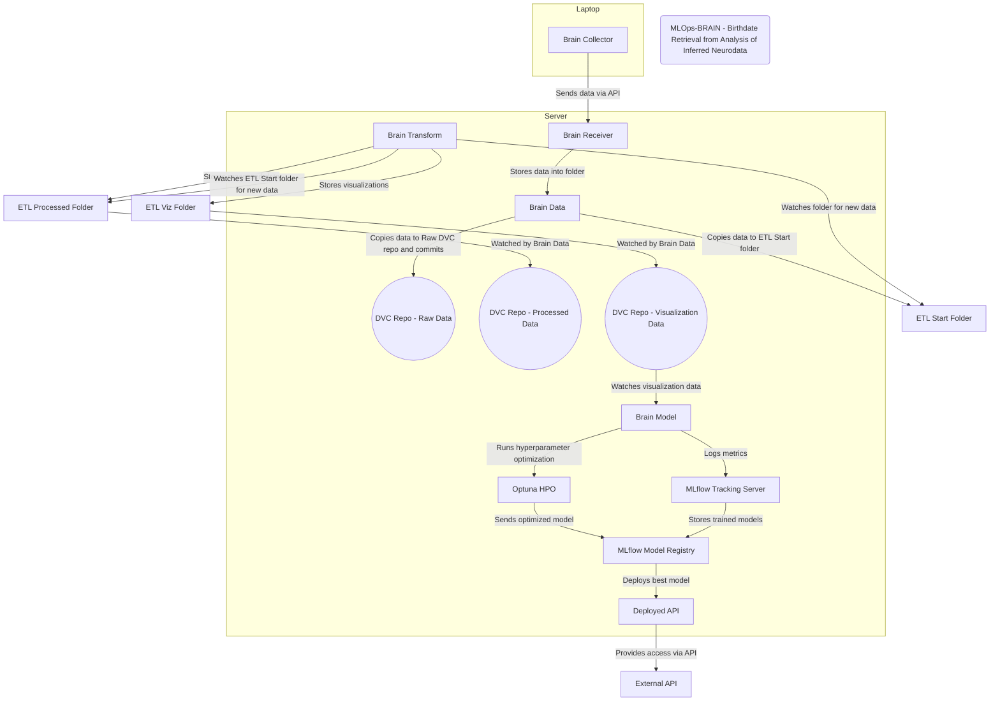

# brain_infrastructure
## Server Setup
### Initial Setup
#### SSH Configuration
```bash
sudo nano /etc/ssh/sshd_config
```
Change the following lines to the following values:
```bash
PasswordAuthentication no
Banner none
PermitRootLogin no 
```
#### Docker Install
Install Docker as described [here](https://docs.docker.com/engine/install/ubuntu/)

After Installation add useres as needed to the docker group so no sudo is needed for docker commands:
```bash

### User Management
```bash
sudo adduser --disabled-password --gecos "" user1
sudo mkdir -p /home/user1/.ssh
sudo chown sttiseess:sttiseess /home/sttiseess/.ssh
sudo chmod 700 /home/sttiseess/.ssh
echo "<PUBLIC_KEY>" | sudo tee /home/sttiseess/.ssh/authorized_keys
sudo chown sttiseess:sttiseess /home/sttiseess/.ssh/authorized_keys
sudo chmod 600 /home/sttiseess/.ssh/authorized_keys
sudo usermod -aG docker user1
sudo usermod -aG docker_services user1
```
Create group to manage permissions for docker services directory:
```bash
sudo groupadd docker_services
sudo usermod -aG docker_services sttiseess
sudo chgrp -R docker_services /services
sudo chmod -R 775 /services
sudo chmod g+s /services
```

### Architecture
